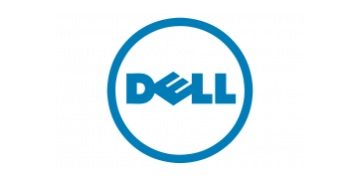

# EFIs

> Hackintosh OpenCore EFI by Brands

- [ASRock-DeskMini-310](/r/ASRock-DeskMini-310 "Hackintosh  MacOS 12 Monertey & 13 Ventura & 14 Sonoma & 15 Sequoia")
- [ASROCK-H410M-ITX-OpenCore](/r/ASROCK-H410M-ITX-OpenCore "Hackintosh OpenCore MacOS 12 Monertey & 13 Ventura & 14 Sonoma")
- [ASRock-DeskMini-H470-OpenCore](/r/ASRock-DeskMini-H470-OpenCore "ASRock DeskMini H470 Hackintosh OpenCore EFI")
- [ASRock-DeskMini-Z370M-STX-MXM-OpenCore](/r/ASRock-DeskMini-Z370M-STX-MXM-OpenCore "ASRock Deskmini Z370 Hackintosh OpenCore MacOS 12 Monertey & 13 Ventura & 14 Sonoma")
- [Asrock-H670M-ITX-OpenCore](/r/Asrock-H670M-ITX-OpenCore "Asrock H670M-ITX/ax Hackintosh OpenCore MacOS 12 Monertey & 13 Ventura & 14 Sonoma")

- [ASUS-P8Z77-V-PRO-OpenCore](/r/ASUS-P8Z77-V-PRO-OpenCore "ASUS P8Z77-V PRO Hackintosh OpenCore 0.9.7")
- [ASUS-Z170i-Pro-Gaming-OpenCore](/r/ASUS-Z170i-Pro-Gaming-OpenCore "ASUS Z170i Pro Gaming Hackintosh OpenCore MacOS 12 Monertey & 13 Ventura & 14 Sonoma")
- [ASUS-PRIME-Z690-P-D4-OpenCore](/r/ASUS-PRIME-Z690-P-D4-OpenCore "ASUS Z690P Hackintosh OpenCore MacOS 12 Monertey & 13 Ventura & 14 Sonoma")
- [ASUS-VC66-C2-MiniPC-OpenCore](/r/ASUS-VC66-C2-MiniPC-OpenCore "VC66-C2 Hackintosh OpenCore MacOS 12 Monertey & 13 Ventura & 14 Sonoma")
- [ASUS-PRIME-B760M-K-D4-OpenCore](/r/ASUS-PRIME-B760M-K-D4-OpenCore "PRIME B760M-K OpenCore MacOS 12 Monertey & 13 Ventura & 14 Sonoma")
- [ASUS-TX-GAMING-B760M-WIFI-OpenCore](/r/ASUS-TX-GAMING-B760M-WIFI-OpenCore "华硕天选 TX GAMING B760M WIFI Hackintosh OpenCore MacOS 12 Monertey & 13 Ventura & 14 Sonoma")
- [ROG-B760A-GAMING-WIFI-OpenCore](/r/ROG-B760A-GAMING-WIFI-OpenCore "ROG STRIX B760-A GAMING WIFI  Hackintosh OpenCore MacOS 12 Monertey & 13 Ventura & 14 Sonoma")
- [ROG-STRIX-B760-I-GAMING-OpenCore](/r/ROG-STRIX-B760-I-GAMING-OpenCore "ROG STRIX B760i GAMING Hackintosh For MacOS 12 Monterey-15 Sequoia")
- [ROG-Strix-B460i-Gaming-OpenCore](/r/ROG-Strix-B460i-Gaming-OpenCore "Hackintosh MacOS 12 Monertey & 13 Ventura & 14 Sonoma & Sequoia 15")
- [ROG-MAXIMUS-XII-HERO-WiFi-OpenCore](/r/ROG-MAXIMUS-XII-HERO-WiFi-OpenCore "ROG MAXIMUS XII HERO WiFi Hackintosh OpenCore MacOS 12 Monertey & 13 Ventura & 14 Sonoma")
- [TUF-B760M-Plus-OpenCore](/r/TUF-B760M-Plus-OpenCore "TUF B760M Plus Hackintosh OpenCore MacOS 12 Monertey & 13 Ventura & 14 Sonoma")

- [BIOSTAR-B660GTN-OpenCore](/r/BIOSTAR-B660GTN-OpenCore "Hackintosh OpenCore MacOS 12 Monertey & 13 Ventura & 14 Sonoma")
- [Hackintosh-BIOSTAR-B660T-Silver-EFI](/r/Hackintosh-BIOSTAR-B660T-Silver-EFI "BIOSTAR B660T Hackintosh OpenCore MacOS 12 Monertey & 13 Ventura & 14 Sonoma")

- [DELL-3090MFF-OpenCore](/r/DELL-3090MFF-OpenCore "DELL 3090 MFF Hackintosh OpenCore MacOS 12 Monertey & 13 Ventura & 14 Sonoma")
- [dell-optiplex-3080-mff](/r/dell-optiplex-3080-mff "Dell OptiPlex 3080 Micro (3080MFF) Hackintosh OpenCore EFI")
- [Dell-Vostro-3250-OpenCore](/r/Dell-Vostro-3250-OpenCore "Dell Vostro 3250 OpenCore EFI")
- [DELL-7460-OpenCore](/r/DELL-7460-OpenCore "dell inspiron 7460 Hackintosh MacOS 12 Monertey & 13 Ventura & 14 Sonoma")

- [ERYING-B760I-ARGB-OpenCore](/r/ERYING-B760I-ARGB-OpenCore "尔英 B760i ARGB ITX Hackintosh OpenCore MacOS 12 Monertey & 13 Ventura & 14 Sonoma")
- [ERYING-POLESTAR-H770-MATX-OpenCore](/r/ERYING-POLESTAR-H770-MATX-OpenCore "尔英 POLESTAR 极星 H770 黑苹果")
- [ERYING-B760I-OpenCore](/r/ERYING-B760I-OpenCore "尔英 B760i ITX DDR4 Hackintosh OpenCore MacOS 12 - 15")

- [GIGABYTE-H110M-DS2V-OpenCore](/r/GIGABYTE-H110M-DS2V-OpenCore "GIGABYTE H110M Hackintosh OpenCore MacOS 12 Monertey & 13 Ventura & 14 Sonoma")
- [Gigabyte-Z790M-Aorus-Elite-AX-OpenCore](/r/Gigabyte-Z790M-Aorus-Elite-AX-OpenCore "Z790M Aorus Elite AX Hackintosh OpenCore MacOS 12 - 15")
- [Gigabyte-Z790i-AORUS-ULTRA-OpenCore](/r/Gigabyte-Z790i-AORUS-ULTRA-OpenCore "Gigabyte Z790i AORUS ULTRA Hackintosh OpenCore MacOS 12 Monertey & 13 Ventura & 14 Sonoma")
- [Gigabyte-B760i-AORUS-PRO-OpenCore](/r/Gigabyte-B760i-AORUS-PRO-OpenCore "Gigabyte B760i AORUS PRO Hackintosh OpenCore MacOS 12 Monertey & 13 Ventura & 14 Sonoma")
- [Gigabyte-B560M-Aorus-Pro-AX](/r/Gigabyte-B560M-Aorus-Pro-AX "Gigabyte B560M Aorus Pro AX Hackintosh MacOS 12 Monertey -- 15 Sequoia")
- [GB-BRi7H-8550-OpenCore](/r/GB-BRi7H-8550-OpenCore "Hackintosh OpenCore 0.9.4 macos 12 Monertey and 13 Ventura")
- [GA-H170MSTX-DATTO-O3](/r/GA-H170MSTX-DATTO-O3 "云轩H170 OpenCore 1.0.4 黑苹果引导文件 支持macOS 11-15 系统")

- [HP-ProDesk-400-G3-DM-OpenCore](/r/HP-ProDesk-400-G3-DM-OpenCore "HP ProDesk 400 G3 DM Hackintosh OpenCore MacOS 12 Monertey & 13 Ventura & 14 Sonoma")
- [HP-Pavilion-Desktop-590-8700](/r/HP-Pavilion-Desktop-590-8700 "HP Pavilion Desktop 590 OpenCore EFI")
- [HP-288-G3-MT-OpenCore](/r/HP-288-G3-MT-OpenCore "Hackintosh OpenCore 0.9.4 macos 12 Monertey and 13 Ventura")
- [HP-EliteDesk-800-G5-DM-OpenCore](/r/HP-EliteDesk-800-G5-DM-OpenCore "HP 800 G5 DM Hackintosh OpenCore MacOS 12 Monertey & 13 Ventura  & 14 Sonoma")
- [HP-EliteDesk-800-G1-Ultra-slim-Desktop-OpenCore](/r/HP-EliteDesk-800-G1-Ultra-slim-Desktop-OpenCore "HP EliteDesk 800 G1 USDT Hackintosh OpenCore MacOS 11 Big Sur & 12 Monertey & 13 Ventura")

- [intel-nuc12-extreme](/r/intel-nuc12-extreme "Intel NUC12 Extreme Hackintosh OpenCore EFI")
- [intel-nuc10](/r/intel-nuc10 "Intel NUC10i7(5/3)FNH(K) Hackintosh OpenCore EFI")

- [JINGYUE-X99M-PLUS-D4-OpenCore](/r/JINGYUE-X99M-PLUS-D4-OpenCore "JGINYUE X99M PLUS D4 Hackintosh OpenCore MacOS 12-15")
- [JINGYUE-B760I-SNOW-DREAM-OpenCore](/r/JINGYUE-B760I-SNOW-DREAM-OpenCore "精粤 B760i snow Hackintosh MacOS 12 Monertey -- 15 Sequoia")
- [JINGYUE-B760I-GAMING-OpenCore](/r/JINGYUE-B760I-GAMING-OpenCore "精粤B760I GAMING Hackintosh MacOS 12 Monertey & 13 Ventura & 14 Sonoma")
- [Jginyue-B760M-Snow-Dream-OpenCore](/r/Jginyue-B760M-Snow-Dream-OpenCore "精粤 B760M Snow Dream Hackintosh MacOS 12 Monertey to 15 Sequoia ")

- [ThinkCentre-E77](/r/ThinkCentre-E77 "ThinkCentre-E77 Intel Gen10 Hackintosh EFI")
- [Lenovo-QiTian-M437](/r/Lenovo-QiTian-M437 "Hackintosh OpenCore 0.9.7 macos 12 Monertey and 13 Ventura")
- [Lenovo-ThinkCentre-M730s](/r/Lenovo-ThinkCentre-M730s "Hackintosh OpenCore 0.9.7 macos 12 Monertey and 13 Ventura")
- [Lenovo-IdeaCentre-AIO-YI-24ICB-OpenCore](/r/Lenovo-IdeaCentre-AIO-YI-24ICB-OpenCore "Lenovo AIO Hackintosh OpenCore MacOS 12 Monertey & 13 Ventura & 14 Sonoma")
- [ThinkCentre-M70q](/r/ThinkCentre-M70q "Lenovo ThinkCentre M70q Hackintosh OpenCore EFI")
- [ThinkCentre-M80q](/r/ThinkCentre-M80q "Lenovo ThinkCentre M80q (Gen1 10th Intel CPU) Hackintosh OpenCore EFI")
- [Lenovo-M710q-OpenCore](/r/Lenovo-M710q-OpenCore "M710q Hackintosh OpenCore MacOS 12 Monertey & 13 Ventura & 14 Sonoma")
- [lenovo-M650-M750t-OpenCore](/r/lenovo-M650-M750t-OpenCore "Lenvo M650 & ThinkCentre M760t Hackintosh macOS 12 Monterey - 15 Sequoia")
- [ThinkCentre-M930q](/r/ThinkCentre-M930q "ThinkCentre M930q Hackintosh OpenCore EFI")
- [ThinkCentre-M910s](/r/ThinkCentre-M910s "Hackintosh OpenCore 0.9.5 macos 12 Monertey & 13 Ventura & 14 Sonoma")

- [MAXSUN-TERMINATOR-B760ITX-D4-WIFI-OpenCore](/r/MAXSUN-TERMINATOR-B760ITX-D4-WIFI-OpenCore "MS-B760i Hackintosh MacOS 12 Monertey -- 15 Sequoia")
- [MAXSUN-TERMINATOR-B760M-OpenCore](/r/MAXSUN-TERMINATOR-B760M-OpenCore "铭瑄 B760M Hackintosh MacOS 12 Monertey & 13 Ventura & 14 Sonoma & 15 Sequoia")
- [Maxsun-Challenger-H610ITX-OpenCore](/r/Maxsun-Challenger-H610ITX-OpenCore "铭瑄 H610ITX 黑苹果 macos 12 - 15 ")
- [MAXSUN-B660M-TERMINATOR-OpenCore](/r/MAXSUN-B660M-TERMINATOR-OpenCore "MAXSUN B660M Hackintosh OpenCore MacOS 12 Monertey & 13 Ventura & 14 Sonoma")

- [MSI-B85i-OpenCore](/r/MSI-B85i-OpenCore "MSI B85i Hackintosh OpenCore MacOS 12 Monertey and 13 Ventura")
- [MSI-MAG-B560M-MORTAR-OpenCore](/r/MSI-MAG-B560M-MORTAR-OpenCore "MAG B560M MORTAR Hackintosh OpenCore MacOS 12 Monertey & 13 Ventura & 14 Sonoma")
- [MSI-B760M-BOMBER-WIFI-OpenCore](/r/MSI-B760M-BOMBER-WIFI-OpenCore "MSI B760M BOMBER Hackintosh OpenCore MacOS 12 Monertey & 13 Ventura & 14 Sonoma")
- [MSI-Z390-A-PRO-OpenCore](/r/MSI-Z390-A-PRO-OpenCore "MSI Z390 A PRO Hackintosh OpenCore MacOS 12 Monertey & 13 Ventura & 14 Sonoma")
- [MSI-PRO-B660M-A-WIFI-DDR4-OpenCore](/r/MSI-PRO-B660M-A-WIFI-DDR4-OpenCore "MSI PRO B660M-A WIFI DDR4 Hackintosh OpenCore MacOS 12 Monertey & 13 Ventura & 14 Sonoma")
- [MSI-PRO-B760M-G-DDR4-OpenCore](/r/MSI-PRO-B760M-G-DDR4-OpenCore "MSI PRO B760M-G DDR4 Hackintosh OpenCore MacOS 12 Monertey & 13 Ventura & 14 Sonoma")
- [MSI-PRO-Z690-A-WIFI-DDR4](/r/MSI-PRO-Z690-A-WIFI-DDR4 "MSI PRO Z690 A WIFI DDR4 Hackintosh OpenCore MacOS 12 Monertey & 13 Ventura & 14 Sonoma")
- [MAG-B365M-MORTAR-OpenCore](/r/MAG-B365M-MORTAR-OpenCore "MAG B365M MORTAR Hackintosh OpenCore MacOS 12 Monertey & 13 Ventura & 14 Sonoma")
- [MAG-B660M-MORTAR-WIFI-DDR4-OpenCore](/r/MAG-B660M-MORTAR-WIFI-DDR4-OpenCore "MAG B660M Hackintosh OpenCore MacOS 12 Monertey & 13 Ventura & 14 Sonoma")
- [MAG-B760M-MORTAR-OpenCore](/r/MAG-B760M-MORTAR-OpenCore "MAG B760M MORTAR Hackintosh OpenCore MacOS 12 Monertey & 13 Ventura & 14 Sonoma")
- [MAG-B460M-MORTAR-OpenCore](/r/MAG-B460M-MORTAR-OpenCore "Hackintosh OpenCore MacOS 12 Monertey & 13 Ventura & 14 Sonoma & 15 Sequoia")

- [TianBang-13900H-ES-ITX-OpenCore](/r/TianBang-13900H-ES-ITX-OpenCore "天邦 13900H ES ITX Hackintosh OpenCore MacOS 12 Monertey & 13 Ventura & 14 Sonoma")
- [JUBO-H510-AIO-OpenCore](/r/JUBO-H510-AIO-OpenCore "JUBO H510 AIO Hackintosh OpenCore MacOS 12 Monertey & 13 Ventura & 14 Sonoma")
- [Unis-526S-G2-OpenCore](/r/Unis-526S-G2-OpenCore "紫光 526S G2 Hackintosh OpenCore MacOS 12 Monertey & 13 Ventura & 14 Sonoma")
